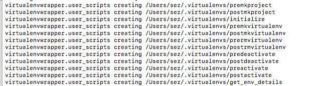

# CVonMac

Set up OpenCV and TensorFlow on Mac.  Based on a tutorial [on PyImageSearch](https://www.pyimagesearch.com/2016/12/05/macos-install-opencv-3-and-python-3-5/).

# Install XCode

If you don't have Xcode set up yet, download it, using the *App Store* app on your Mac
and install the command line tools.


Type the following commands into the Mac `Terminal`:

```bash
sudo xcodebuild -license

sudo xcode-select --install
```

# Download these scripts

```bash
mkdir -p $HOME/depot

git clone https://github.com/sarah-j-smith/CVonMac.git

cd CVonMac
```

## Optional

If you have *never* used the Mac Terminal before and don't have your `.bashrc` or `.bash_profile`
set up it's a good idea to set up some sensible basic defaults for these files.  Check the
ones [that I use, available over on my Gists page](https://gist.github.com/sarah-j-smith/9eb3ca97aafc57b6f8ebd9c09bb76543).

# Install Pre-requisites

```bash
// Python package manager `pip`
sudo easy_install pip

// [Homebrew](https://brew.sh)
/usr/bin/ruby -e "$(curl -fsSL https://raw.githubusercontent.com/Homebrew/install/master/install)"
brew update

// Set up paths for Brew
cat bash_profile.sh >> ~/.bash_profile
source ~/.bash_profile

// Set up Python 3
brew install python3

// Set up links so that python3 from Brew is used
// The command brew linkapps is deprecated so try the following
(cd /usr/local/bin & sudo ln -s $(find -L /usr/local/Cellar -name python3 -perm +111 -type f | head -1))

// Check its working properly - the below will print nothing if all is OK
[ "/usr/local/bin/python3" == $(which python3) ] || echo "Python 3 is not setup correctly"

// Install virtualenv & virtualenvwrapper - tools for a sandboxed Python environment
// Note as of now there is an issue with the Mac system package "six" so add the 
// switch below to work around this.  Also specify -H to avoid lots of warnings about
// running pip via sudo.
sudo -H pip install virtualenv virtualenvwrapper --ignore-installed six

// Set up paths for virtualenv & virtualenvwrapper
cat bash_profile.2 >> ~/.bash_profile
source ~/.bash_profile
```

If the installation of virtualenv and virtualenvwrapper worked OK, then the last command above
should have produced some output about setting up the virtualenv directories.  It might look
similar to this:



If not, and if the following commands don't work, go back and check it was
installed correctly.  In particular look for errors out of the installation command just above.

```bash
// Create a virtualenv for python
mkvirtualenv cv -p python3

// From now use this command to enter the virtualenv for CV and Python3
workon cv

// Check its working properly - the below will print nothing if all is OK
[ "$HOME/.virtualenvs/cv/bin/python3" == $(which python3) ] || echo "Python 3 virtualenv is not set up correctly"

// Intall numpy - required for OpenCV - make sure (cv) appears at the beginning
// of the command line so that numpy is installed into the virtualenv
pip install numpy

// Install build pre-requisites for OpenCV
brew install cmake pkg-config
brew install jpeg libpng libtiff openexr
brew install eigen tbb
```

# Built OpenCV

OpenCV is the Open Source Computer Vision library, implemented in C++.  It has an iOS package and
also Python bindings.

## Get OpenCV sources

```bash
// Check [The OpenCV releases and get the latest one](http://opencv.org/releases.html)
curl -L -O https://github.com/opencv/opencv/archive/3.3.0.zip
unzip -q 3.3.0.zip
mv opencv-3.3.0 opencv

// Check the matching [release for OpenCV contrib](https://github.com/opencv/opencv_contrib/releases)
curl -L -O https://github.com/opencv/opencv_contrib/archive/3.3.0.zip
unzip -q 3.3.0.zip
mv opencv_contrib-3.3.0 opencv_contrib
```

## Build OpenCV

```bash
cd opencv
mkdir build
cd build

sh ../../build.sh

make -j4
sudo make install

// Turn on global site packages
// Should say "Enabled global site-packages"
toggleglobalsitepackages cv

// Check that it worked by running the python interpreter

workon cv
python
```

```python
(cv) ~/build/CVonMac/opencv/build $ python
Python 3.6.2 (default, Oct  1 2017, 03:29:21) 
[GCC 4.2.1 Compatible Apple LLVM 9.0.0 (clang-900.0.37)] on darwin
Type "help", "copyright", "credits" or "license" for more information.
>>> import cv2
>>> cv2.__version__
'3.3.0'
```

## Install Python TensorFlow

* Once the above is working [installing TensorFlow is easy](https://www.tensorflow.org/install/install_mac)

```bash
// Ensure the virtualenv is enabled
workon cv    

// Turn on global site packages
// Should say "Enabled global site-packages"
toggleglobalsitepackages cv

pip3 install --upgrade tensorflow
```

* Verify the installation [as described in Google's doc](https://www.tensorflow.org/install/install_mac#validate_your_installation)

    * Warnings about SSE4.2 instructions and AVX instructions can be ignored